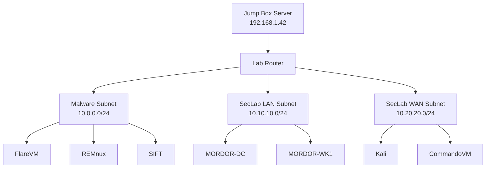

I RDP into a jumpbox on my network and can then access the various subnets within the lab. 

Other devices on my home network are not allowed to talk to those subnets. 

```mermaid

graph TD


    Router2[Lab Router]:::device

    Malware[Malware Subnet<br>10.0.0.0/24]:::subnet
    SecLabWAN[SecLab WAN Subnet <br> 10.20.20.0/24]:::subnet
    SecLabLAN[SecLab LAN Subnet <br> 10.10.10.0/24]:::subnet

    JumpBox[Jump Box Server <br>192.168.1.42]:::server

    Kali[Kali]:::VM
    SIFT[SIFT]:::VM
    CommandoVM[CommandoVM]:::VM
    FlareVM[FlareVM]:::VM
    REMnux[REMnux]:::VM
    MORDORDC[MORDOR-DC]:::ADVM
    MORDORWK1[MORDOR-WK1]:::ADVM


    JumpBox --> Router2

    Router2 --> Malware
    Router2 --> SecLabLAN
    Router2 --> SecLabWAN

    Malware --> FlareVM
    Malware --> REMnux
    Malware --> SIFT

    SecLabWAN --> Kali
    SecLabWAN --> CommandoVM

    SecLabLAN --> MORDORDC
    SecLabLAN --> MORDORWK1

```
