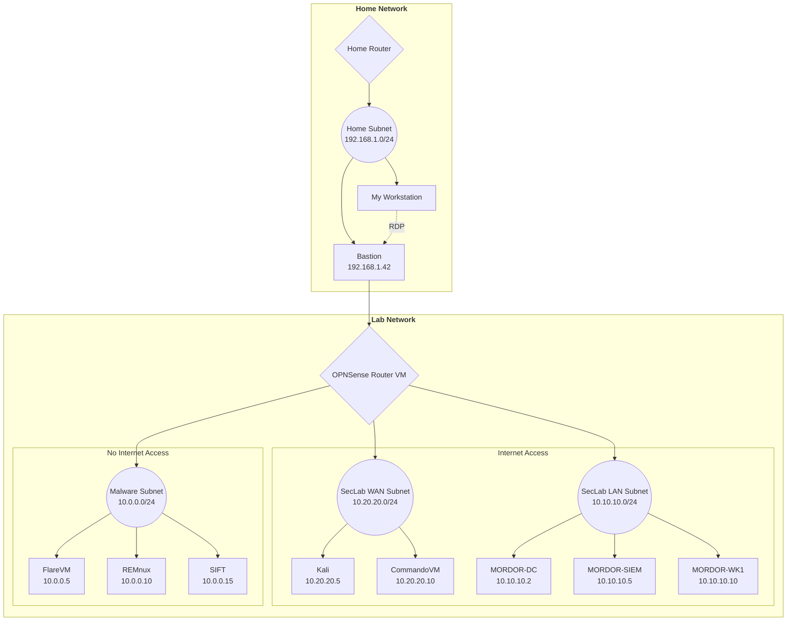

I RDP into a jumpbox on my home network and can then access the various subnets within the lab. 

Other devices on my home network are not allowed to talk to the lab subnets. 

```mermaid

graph TD
    
    Home((Home Subnet<br>192.168.1.0/24))
    Malware((Malware Subnet<br>10.0.0.0/24))
    SecLabLAN((SecLab LAN Subnet <br> 10.10.10.0/24))
    SecLabWAN((SecLab WAN Subnet <br> 10.20.20.0/24))

    JumpBox[Bastion <br>192.168.1.42]
    PC[My Workstation]

    Kali[Kali<br>10.20.20.5]
    CommandoVM[CommandoVM<br>10.20.20.10]

    FlareVM[FlareVM<br>10.0.0.5]
    REMnux[REMnux<br>10.0.0.10]
    SIFT[SIFT<br>10.0.0.15]

    MORDORDC[MORDOR-DC<br>10.10.10.2]
    MORDORSIEM[MORDOR-SIEM<br>10.10.10.5]
    MORDORWK1[MORDOR-WK1<br>10.10.10.10]
    

    JumpBox --> Router2

    Router2 --> Malware
    Router2 --> SecLabLAN
    Router2 --> SecLabWAN

    subgraph 4 [<b>Lab Network]

    Router2{OPNSense Router VM}

        subgraph 1 [No Internet Access]
            Malware --> FlareVM
            Malware --> REMnux
            Malware --> SIFT
        end
    
        subgraph 2 [Internet Access]
            SecLabLAN --> MORDORDC
            SecLabLAN --> MORDORSIEM
            SecLabLAN --> MORDORWK1

            SecLabWAN --> Kali
            SecLabWAN --> CommandoVM
        end

    end

    subgraph 3 [<b>Home Network]
        Router1{Home Router}
        Router1
        Router1 --> Home
        Home --> JumpBox
        Home --> PC
        PC-. RDP .-> JumpBox
    end

```
